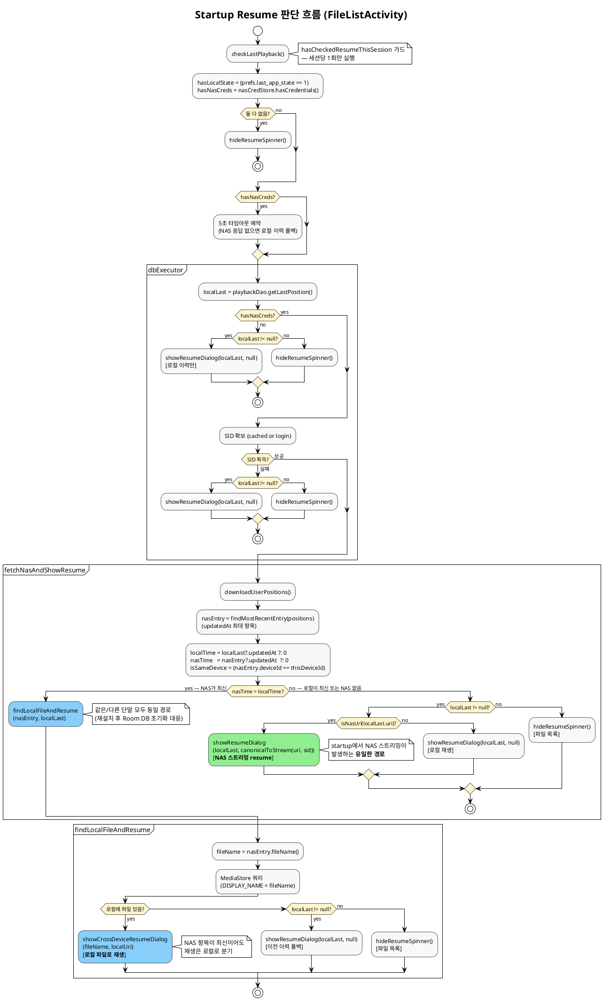

# 재생 위치 동기화 설계

## 1. NAS / Local 업데이트 기준

### 저장 계층

재생 위치는 두 계층에 독립적으로 저장된다.

| 계층 | 저장소 | 키 | 저장 시점 |
|------|--------|-----|-----------|
| Local | Room DB (`playback.db`) | URI (content:// 또는 NAS canonical URL) | 재생 중 5초마다, onPause 시 |
| NAS | `{cfgPosDir}/{user}_positions.json` | 파일명 (확장자 포함, 폴더 없음) | 인메모리 캐시 경유 → 30초마다 or onPause 시 플러시 |

### syncKey 설계

NAS 저장 키는 **파일명만** 사용한다 (폴더명 제외).

```
예: "Mr_ Plankton_S01E02.mkv"   (O)
예: "11월최신드라마/Mr_ Plankton_S01E02.mkv"  (X)
```

**이유**: 단말 A / B가 같은 파일을 서로 다른 폴더에 가지고 있을 수 있다. 폴더명을 포함하면 cross-device 매칭이 불가능하다.

### NAS 저장 항목 구조

```json
{
  "Mr_ Plankton_S01E02.mkv": {
    "positionMs": 1167875,
    "audioTrackId": 1,
    "subtitleTrackId": -1,
    "screenMode": 0,
    "updatedAt": 1744371961000,
    "deviceId": "R3CT70FY0ZP",
    "nasPath": "/video/드라마/Mr_ Plankton_S01E02.mkv"
  }
}
```

| 필드 | 타입 | 필수 | 설명 |
|------|------|------|------|
| `positionMs` | long | 필수 | 마지막 재생 위치 (밀리초). 다음 실행 시 이 위치로 seek한다. |
| `audioTrackId` | int | 필수 | 마지막으로 선택한 오디오 트랙 ID. VLC 트랙 ID 기준. `-1`은 비활성. 다른 단말에서 resume 시 무시된다. |
| `subtitleTrackId` | int | 필수 | 마지막으로 선택한 자막 트랙 ID. VLC 트랙 ID 기준. `-1`은 자막 끔. 다른 단말에서 resume 시 무시된다. |
| `screenMode` | int | 필수 | 화면 맞춤 모드. `0` = 기본, `1` = 가로채움, `2` = 세로채움. 다른 단말에서 resume 시 무시된다. |
| `updatedAt` | long | 필수 | 저장 시각 (Unix epoch ms). 두 단말의 항목이 충돌하면 이 값이 더 큰 쪽을 채택한다. 병합의 유일한 기준. |
| `deviceId` | String | 필수 | 저장한 단말의 `ANDROID_ID` (Settings.Secure). 같은 단말이 저장한 항목인지 판별해 오디오/자막/화면 설정 복원 여부를 결정한다. |
| `nasPath` | String | 선택 | NAS 파일 경로 (예: `/video/드라마/파일.mkv`). NAS 파일 재생 시에만 존재. 로컬 파일은 이 필드 없음. 향후 다른 단말이 NAS에서 직접 재생할 때 스트림 URL 재생성에 사용 예정. |

### NAS 플러시 흐름

onPause 시 덮어쓰기를 방지하기 위해 download → merge → upload 순서로 처리한다.

```
[onPause]
  └─ dbExecutor: flushToNasBlocking()
       1. dirty 아니면 skip
       2. downloadUserPositionsSync()  ← 현재 NAS 파일 가져오기
       3. mergePositions(remote, localSnapshot, positionsCache)  ← updatedAt 기준 병합
       4. uploadUserPositionsSync(merged)
```

onStop에서 최대 4초 대기(`nasFlushing.get(4000ms)`)하여 앱 종료 전 플러시가 완료되도록 보장한다.

### 병합 규칙

같은 키에 대해 두 항목이 존재할 경우 `updatedAt`이 더 큰 항목을 채택한다. 서로 다른 키는 모두 보존된다 (다른 단말의 다른 영상 이력 유지).

---

## 2. Startup 시 재생 판단 기준

앱 시작 시 `FileListActivity.checkResumeOnLaunch()`가 한 번만 실행된다 (`hasCheckedResumeThisSession` 플래그로 중복 방지).

### 전체 흐름 (PlantUML)



### 판단 흐름 요약

```
checkResumeOnLaunch()
  ├─ Room DB: 마지막 재생 이력 (localLast) 조회
  ├─ NAS 로그인 확인 (캐시 SID or 재로그인)
  └─ fetchNasAndShowResume(localLast, sid)
       └─ NAS positions.json 다운로드 → 가장 최신 항목 (nasEntry) 추출
```

### 분기 조건

| 조건 | 동작 |
|------|------|
| `nasTime > localTime` + **다른 단말** | 로컬에서 같은 파일명 검색 → cross-device 다이얼로그 |
| `nasTime > localTime` + **같은 단말** | 동일하게 처리 (앱 재설치로 Room DB 초기화된 경우 등) |
| `nasTime <= localTime` + `localLast` 있음 | 기존 이어보기 다이얼로그 (로컬 or NAS 스트림) |
| 둘 다 없음 | 다이얼로그 없이 파일 목록 표시 |

- `nasTime` = `nasEntry.updatedAt` (NAS의 가장 최근 항목 타임스탬프)
- `localTime` = `localLast.updatedAt` (Room DB의 마지막 저장 타임스탬프)

### Cross-device 다이얼로그

다른 단말의 NAS 항목이 최신일 때:

1. MediaStore에서 `DISPLAY_NAME = 파일명`으로 로컬 파일 검색
2. **로컬에 있으면** → "다른 단말에서 재생 중이던 영상입니다." 다이얼로그 표시 → 선택 시 **로컬 파일로 재생**
3. **로컬에 없으면** → `localLast`가 있으면 기존 이어보기로 폴백, 없으면 리스트

사용자가 "예" 선택 시 `startLocalWithFolderView(localUri, fileName, ...)`로 로컬 MediaStore URI를 사용해 재생한다. 위치(`positionMs`)는 이후 플레이어에서 `NasSyncManager.loadPosition`의 두 번째 콜백으로 복원된다 (Intent extra가 아니라 positions.json 재조회 기반).

### "NAS 스트리밍으로 이어보기"는 언제 발생하는가

현재 구현상 startup resume 분기에서 **NAS 스트리밍을 새로 여는 경로는 단 하나뿐**이다.

- 조건: `nasTime <= localTime` + `localLast.uri`가 NAS canonical URL (`http...`)
- 동작: `canonicalToStream(localLast.uri, sid)`로 스트림 URL을 재발급해 기존 이어보기 다이얼로그 표시

즉 "이 단말에서 마지막으로 NAS 영상을 보고 있었다"가 유일한 진입점이다. **다른 단말 A가 NAS에서 보던 영상을 B 단말이 NAS 스트리밍으로 이어받는 시나리오는 현재 없다** — cross-device 분기는 B 단말 로컬에 같은 파일명이 있을 때만 동작하며 그마저도 로컬 재생으로 귀결된다. 로컬에 없으면 `localLast` 폴백 또는 리스트로 빠진다.

(향후 확장 여지: `nasEntry.nasPath`가 있으므로 B 단말에서 NAS 스트리밍으로 여는 경로는 구현 가능하나 현재 미사용)

### 플레이어에서 위치 복원 (`NasSyncManager.loadPosition`)

플레이어가 시작되면 두 단계로 위치를 복원한다.

```
loadPosition(syncKey, roomDbKey, callback)
  1. Room DB 조회 → 즉시 콜백 (빠른 시작)
  2. NAS 캐시 비교
     - 캐시 비어있음 → downloadUserPositionsSync()로 동기 로드 후 비교
     - NAS updatedAt > DB updatedAt → 두 번째 콜백으로 NAS 위치 적용
```

콜백은 최대 2회 호출될 수 있다. 두 번째 콜백이 더 최신 위치를 가져오면 플레이어가 해당 위치로 seek한다.

### 같은 단말 vs 다른 단말 복원 범위

| 항목 | 같은 단말 | 다른 단말 |
|------|----------|----------|
| 재생 위치 (`positionMs`) | 복원 | 복원 |
| 오디오 트랙 (`audioTrackId`) | 복원 | **무시** |
| 자막 트랙 (`subtitleTrackId`) | 복원 | **무시** |
| 화면 모드 (`screenMode`) | 복원 | **무시** |

다른 단말은 화면 크기, 자막 취향이 다를 수 있으므로 위치만 이어받는다.

---

## 3. 즐겨찾기

### 저장 범위

즐겨찾기는 **로컬 Room DB 전용**이다. NAS `positions.json`과 공유되지 않는다. 따라서 단말 간 즐겨찾기 목록은 서로 독립적이다.

| 저장소 | 테이블 | 정렬 |
|--------|--------|------|
| Room DB | `favorite` | `addedAt DESC` |

### 엔티티 (`Favorite`)

| 필드 | 타입 | 설명 |
|------|------|------|
| `id` | long | 자동 생성 PK. 같은 파일도 여러 번 저장 가능 (다른 위치 북마크). |
| `uri` | String | 로컬 `content://` URI 또는 NAS canonical URL (SID 제외). |
| `name` | String | 파일명. |
| `isNas` | boolean | NAS 파일 여부. |
| `nasPath` | String | NAS 전용. `/video/폴더/파일.mkv` — SID 재발급 시 스트림 URL 재생성용. |
| `bucketId` / `bucketDisplayName` | String | 로컬 전용. 같은 폴더 플레이리스트 복원용. |
| `positionMs` | long | 추가 시점의 재생 위치 스냅샷. |
| `addedAt` | long | 추가 시각. 정렬 기준. |
| `isRecent` | boolean | `@Ignore` — DB 저장 안 됨. "마지막 재생" 합성 항목 플래그 (빨간 별표 표시). |

### 추가 (`MainActivity.addCurrentToFavorites`)

플레이어에서 현재 상태 스냅샷으로 추가한다.

- `positionMs` = `mediaPlayer.getTime()` (음수면 0 clamp)
- `isNas` = `DsFileApiClient.isNasUrl(uri) || uri.startsWith("http")`
- NAS면 현재 플레이리스트 항목에서 `nasPath` 보존, 로컬이면 `bucketId`/`bucketDisplayName` 보존
- **NAS 업로드 없음** — 다른 단말에는 보이지 않는다

### 목록 구성 (`FileListActivity.loadFavorites`)

즐겨찾기 탭은 두 섹션을 합쳐 표시한다.

```
[상단] "마지막 재생" 합성 항목 (빨간 별표, 최대 2개)
  ├─ getLastLocalPosition() → isNas=false, isRecent=true
  └─ getLastNasPosition()   → isNas=true,  isRecent=true
[이후] favoriteDao.getAll()  (사용자가 추가한 즐겨찾기, 노란 별표)
```

`getLastLocalPosition` / `getLastNasPosition`은 `playback_position` 테이블에서 URI prefix(`http%`)로 로컬/NAS를 구분해 각각 최신 1개를 가져온다 (PlaybackDao.java:14-20).

"마지막 재생" 항목은 DB에 저장된 Favorite이 아니므로 **삭제 불가** (`confirmDeleteFavorite`가 `isRecent`면 즉시 return).

### 재생 (`playFavorite`)

```
playFavorite(fav)
  1. playback_position에 fav 정보 기록 (updatedAt = now)
     → 이후 기존 이어보기 로직이 이 항목을 "최신"으로 보게 함
  2. fav.isNas ?
       YES → playFavoriteNas  (SID 재발급 → nasPath로 스트림 URL 재생성)
       NO  → playFavoriteLocal (startLocalWithFolderView)
```

**포인트:** 즐겨찾기의 `positionMs`는 추가 시점 스냅샷이지만, 실제 재생 시 플레이어는 `NasSyncManager.loadPosition`으로 Room DB + NAS `positions.json`을 비교해 더 최신 위치로 seek한다. 따라서 즐겨찾기 추가 이후 다른 단말에서 같은 파일을 더 본 적이 있다면 **NAS의 더 최신 위치가 우선**된다.

### 로컬 / NAS 재생 헬퍼

| 헬퍼 | 동작 |
|------|------|
| `startLocalWithFolderView` | `bucketId` 없으면 MediaStore에서 URI 역조회 → 같은 폴더 영상 목록을 PlaylistHolder에 넣고 MainActivity 실행. Back 시 해당 폴더 화면으로 복귀. |
| `launchNasFavorite` | `startNasWithFolderRecovery(nasPath, canonicalUrl, name, sid)` — SID 만료 대응 위해 항상 재발급된 SID로 스트림 URL 생성. |

### 삭제

목록 항목 롱프레스 → 확인 다이얼로그 → `favoriteDao.deleteById(id)` → `loadFavorites()` 재조회.
